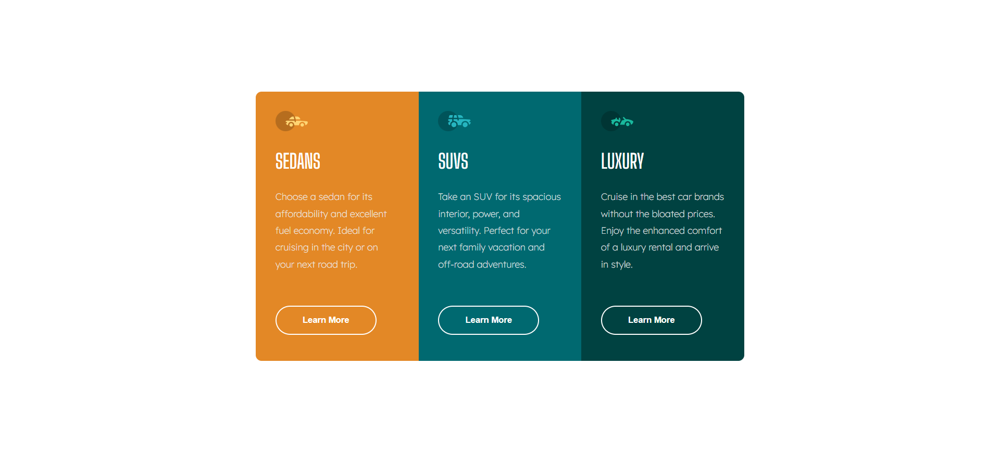
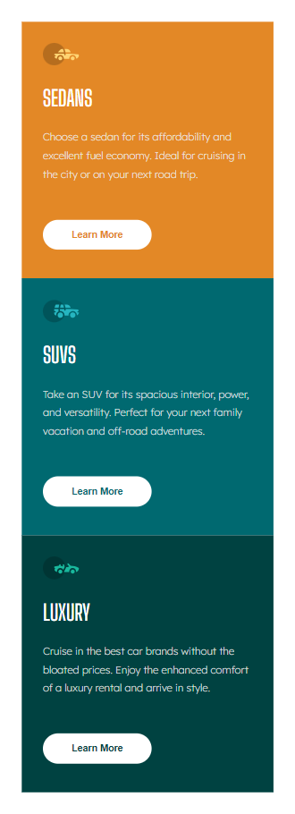

# 3-Column Preview Card Component

This project is a responsive 3-column preview card component designed to showcase different types of vehicles. It is part of the Frontend Mentor challenges.

## Live Demo

You can view the live version of the project [here](https://yasseresam.github.io/3-column-preview-card-component----FrontEnd-Monetor/).

## Project Overview

The component consists of three cards, each representing a different category of vehicle:
- Sedans
- SUVs
- Luxury

Each card includes an image, a title, a description, and a "Learn More" button.

## Features

- **Responsive Design**: The component adjusts to different screen sizes.
- **Accessible**: Each image has an `alt` attribute for better accessibility.

## Screenshots

Thanks a lot